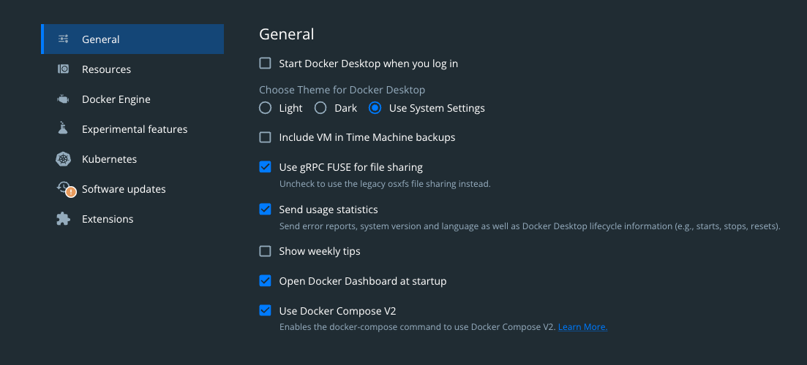

# Node-Red Node Generator CLI
The CLI to generate custom node-red nodes.


## Installation
```
npm i -g @a8n/node-red-nodegen
```

## Usage
When in doubt, use the `--help` flag to any command.

Start from scratch:
```
nrg init --name my-first-node
```
Use an OpenAPI Spec file:
```
nrg generate ./my-spec-file.yml --name my-node-from-spec
```


## Testing Locally
### Docker
If you're running Node Red via Docker, update your docker file 
to include the new node. Here's a full example:
```dockerfile
version: '3.8'
services:
  nodered:
    image: nodered/node-red:latest
    ports:
      - "1880:1880"
    volumes:
      - ./data:/data
      - ./path/to/custom-node:/data/node_modules/package-name-with-scope-if-used
```

> NOTE: If you're using Docker Desktop, enable the "Use Docker Compose V2" in the General Settings section:


`docker-compose up`

You're custom node should now be an option.
